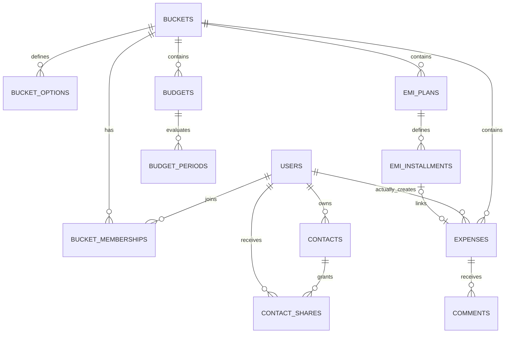

# Buckit — Database Design

Version: 0.1 · Status: Design for review · Date: 23 September 2026

Baseline: PRD.md v1.1 and SYSTEM_DESIGN.md v0.2. This document specifies the MongoDB/Mongoose design for the agreed V1. It does not change product scope, create a database, or define the API contract. Collection names, state names, and index choices below are implementation decisions for review.

## 1. Design boundaries

Use MongoDB Atlas with Mongoose in the Next.js Node.js backend. Firebase Authentication owns credentials and authentication identities; MongoDB owns Buckit profiles, permissions, spending records, and application state. Never store passwords or Firebase refresh tokens in MongoDB.

The database must preserve these distinctions:

- An expense's actual creator controls editing. Paid By controls member-budget matching. Added By is display attribution. These are three separate references.
- Each bucket has its own accounts, categories, platforms, primary currency, timezone, expenses, budgets, and EMI plans.
- Future expenses and unpaid EMI obligations are not actual spending.
- Negative amounts reduce spending; accounts do not have computed or maintained bank balances.
- Contacts and explicit sharing grants belong to users, independently of buckets.
- Notification events, in-app inbox items, and push delivery attempts are different records. Saving an expense must not depend on push delivery succeeding.
- Scheduled work and imports are retryable without creating duplicate financial entries.

There are no collections for settlements, balances, beneficiary tracking, application email, Telegram, or separate account types.

## 2. Shared storage conventions

| Convention | Design |
| --- | --- |
| Identifiers | BSON ObjectId internally; string identifiers at API boundaries |
| Authentication mapping | A unique Firebase UID on an active app user; references within Buckit use user ObjectIds |
| Money | BSON Decimal128, constructed from validated decimal strings; never floating-point JavaScript arithmetic |
| Exchange rates | Positive Decimal128 with more precision than currency amounts |
| Currency | Uppercase supported currency code; validate against the application's currency registry |
| Calendar dates | Validated ISO `YYYY-MM-DD` strings for expense dates and period boundaries; CSV uses `DD/MM/YYYY` |
| Instants | BSON Date in UTC for timestamps, eligibility, leases, and expiration |
| Timezones | Validated IANA names; retain the timezone used to calculate a scheduled eligibility instant |
| Common fields | `_id`, `createdAt`, `updatedAt`; mutable domain records also have an explicit integer `revision` |
| Optimistic updates | Match expected `revision`, then increment it; do not rely on Mongoose's default version behavior for arbitrary updates |
| Names | Preserve display text; use a separately normalized, trimmed, case-insensitive key for uniqueness |
| Optional identifiers | Omit absent references. Avoid explicit null where partial unique indexes distinguish presence |
| References | MongoDB references are not foreign keys. The domain service validates existence, bucket, type, membership, and lifecycle |
| Sensitive data | Keep tokens and contact data out of logs, event payloads, and generic push text |

Money validation uses each currency's minor-unit precision. Quantize the converted amount once and store it; sum stored amounts for reports. A nonzero original amount can round to zero in the bucket currency. This does not make the original entry invalid. A manually entered conversion must preserve the original sign and produce a positive exchange rate; reject an unusable zero manual conversion where a rate cannot be derived.

Monthly recurrence retains its intended day independently of its last actual date. A schedule anchored on day 31 becomes February's last day, then March 31. Compare calendar dates in the appropriate timezone, not the server's timezone. Resolve a nonexistent local time to the next valid instant and an ambiguous repeated time to the first occurrence, with occurrence-key deduplication. A timezone change preserves stored expense dates and posted history; recalculate eligibility for remaining unposted future entries under a version guard. Reminder timezone changes similarly recalculate their next eligible occurrence without replaying emitted occurrence keys.

Avoid unbounded arrays: members, expenses, comments, installments, import rows, inbox items, and deliveries are separate documents. Small validated arrays, such as budget category IDs and selected alert percentages, may be embedded with explicit application limits.

## 3. Collection map

| Collection | Purpose and scope |
| --- | --- |
| `users` | Buckit profile, application access state, preferences, and Firebase mapping |
| `buckets` | Bucket identity, owner, currency, timezone, lifecycle, concurrency guards |
| `bucket_memberships` | Membership episodes, including historical departures |
| `bucket_archive_intervals` | Archive periods used to recognize paused scheduled entries |
| `bucket_options` | Bucket accounts, categories, and platforms, distinguished by kind |
| `invitations` | Revocable, expiring multi-use invitation tokens |
| `expenses` | Manual, imported, and EMI expense records and conversion state |
| `emi_plans` | Fixed monthly plan definitions and generation progress |
| `emi_installments` | Individual obligations and their relationship to expenses |
| `budgets` | Shared/member-specific budget definitions |
| `budget_periods` | Rebuildable usage cache and durable threshold handling per period |
| `comments` | Expense comments with real authorship |
| `contacts` | User-owned contact details |
| `contact_shares` | Explicit recipient access and recipient-specific hiding |
| `reminders` | Personal recurrence definitions and scheduling progress |
| `push_installations` | User/device push registrations |
| `domain_events` | Durable notification-relevant facts and fan-out progress |
| `notifications` | In-app inbox items only |
| `push_deliveries` | Per-event, per-user, per-installation push delivery intents |
| `audit_events` | Actual actors and domain-change history |
| `import_sessions` | Validated import scope, mapping decisions, and progress |
| `import_rows` | Independently validated and committed row outcomes |
| `fx_rate_cache` | Reusable provider rates, independent of applied expense snapshots |
| `operation_receipts` | Durable idempotency receipts for domain mutations |
| `background_jobs` | Leases, checkpoints, retry state, and resumable cleanup |
| `deletion_tombstones` | Durable deletion/anonymization instructions for cleanup and recovery |

The collections are logical boundaries, not separate database servers or paid services. Do not put an entire bucket into one document.

The diagram is conceptual. Reference consistency and permissions are enforced by application transactions, not by the diagram or `populate()`.

## 4. Users, buckets, and access

### 4.1 `users`

Required fields: `status` (`active`, `deleting`, `deleted`), `displayName`, `timezone`, `theme` (`light`, `dark`, `system`), `revision`, and an integer `accessRevision` used as a lifecycle write guard. Active users also have `firebaseUid` and normalized authentication email. Optional fields include `avatarUrl`, `lastBucketId`, and tour progress (`version`, `state`, `lastStep`).

Embed a bounded `notificationPreferences` map keyed by the supported trigger catalog. Each value has independent `inApp` and `push` booleans, plus an `enabledSince` timestamp for each enabled channel. Initial optional-trigger values are true and false respectively. Enabling or re-enabling sets a new timestamp; events predating it cannot be delivered later merely because fan-out was delayed. Authentication email behavior is not stored in this map.

On deletion, remove Firebase mapping, email, avatar, and personal profile data after access is revoked. Keep a minimal pseudonymous user stub with `displayName: "Deleted user"` where historical records reference its ID. A later registration is a new Buckit identity and cannot reclaim that history merely by using the same email.

Indexes:

- Unique partial `{ firebaseUid: 1 }` where `firebaseUid` is a string.
- `{ status: 1, updatedAt: 1 }` for lifecycle cleanup.

Email is not the authorization key. No public user-directory query is supported. Contact-recipient search first restricts to users sharing a current bucket, then searches that eligible set.

### 4.2 `buckets`

Fields: `name`, `ownerUserId`, `primaryCurrency`, `currencyLockedAt?`, `timezone`, `status` (`active`, `archived`, `deleting`), `archivedAt?`, `lifecycleVersion`, `writeRevision`, `exportRevision`, `financialRevision`, and common timestamps/revision.

- Exactly one owner must also have a current membership. Store owner identity here rather than duplicating an independently mutable owner role on every membership.
- Set `currencyLockedAt` atomically with the first expense creation, including future/imported entries. Never clear it on expense deletion.
- `writeRevision` is a serialization guard for authorized bucket mutations. Lifecycle operations use the same guard.
- `financialRevision` changes when eligible spending inputs change and invalidates budget/report caches.
- `exportRevision` changes when exported content changes, including comments and exported labels. It is distinct from routine job bookkeeping.
- `lifecycleVersion` changes on archive/restore/deletion and supports safe job invalidation.

Index: `{ ownerUserId: 1, status: 1 }`. Bucket lists normally start from memberships.

### 4.3 `bucket_memberships`

Fields: `bucketId`, `userId`, `state` (`active`, `left`, `removed`, `account_deleted`), `joinedAt`, `endedAt?`, `endedByUserId?`, `endReason?`, and `revision`.

Each join after departure creates a new membership document. Historical expenses retain the membership ID under which they were created. This prevents rejoining from silently reactivating old schedules or old member-specific budgets. IDs referencing a former member are still valid historical identities, not evidence of current access.

Indexes:

- Unique partial `{ bucketId: 1, userId: 1 }` where `state = active`.
- `{ userId: 1, state: 1, bucketId: 1 }` for the bucket selector and association lookup.
- `{ bucketId: 1, state: 1, userId: 1 }` for member lists and notification recipients.

Authorization always requires active app user plus current membership plus the permitted bucket state. A stale `lastBucketId`, cached membership, historical payer reference, or supplied CSV name never grants access.

### 4.4 `bucket_archive_intervals`

Fields: `bucketId`, `startedAt`, `endedAt?`, `startedByUserId`, `endedByUserId?`, `lifecycleVersion`.

Index `{ bucketId: 1, startedAt: 1 }`; unique partial `{ bucketId: 1 }` for the open interval, represented by `isOpen: true`. Closing updates `isOpen` and `endedAt` atomically with restoration.

The scheduling service consults intervals even if the daily job never ran while the bucket was archived. An unposted entry that was already due when archival began, or became due while archived, requires creator review after restoration. A normal processing outage outside an archive interval does not create that review requirement.

### 4.5 `bucket_options`

Fields: `bucketId`, `kind` (`account`, `category`, `platform`), `name`, `nameKey`, `state` (`active`, `archived`), `createdByUserId`, `archivedAt?`, `revision`. Category options also have `iconKey`; accounts may have `ownerLabel`. The default Other platform has `systemKey: "other"`.

Indexes:

- Unique `{ bucketId: 1, kind: 1, nameKey: 1 }`, including archived names.
- `{ bucketId: 1, kind: 1, state: 1, name: 1 }`.
- Unique partial `{ bucketId: 1, kind: 1, systemKey: 1 }` where `systemKey` is a string.

Keep Other available for defaulting. Validate the referenced option's kind and bucket on every write. New entries cannot select archived options; existing scheduled associations remain valid. Before deleting an unused option, check expenses, plans, installments, and budgets in the same guarded workflow. Used options are archived. Retain the referenced document for historical labels and filtering; store the label at selection time on financial records where historical display is required. Renaming an option does not rewrite those recorded labels.

### 4.6 `invitations`

Fields: `bucketId`, `createdByUserId`, `tokenHash`, `expiresAt`, `revokedAt?`, `createdAt`. The raw high-entropy token is returned for sharing but not stored. Expiration is seven days after creation; link and QR use the same token.

Indexes: unique `{ tokenHash: 1 }`; `{ bucketId: 1, createdAt: -1 }`.

Joining is a deliberate authenticated mutation. Check expiration, revocation, bucket activity, and app-user status during the guarded transaction, then insert a membership unless already active. Do not consume a multi-use link after one join. Link previews and GET requests never join a bucket. Expiration must be checked explicitly, regardless of cleanup timing.

## 5. Expenses and currency

### 5.1 `expenses`

| Field/group | Type and meaning |
| --- | --- |
| `bucketId` | Required bucket reference |
| `actualCreatorUserId` | Immutable actual owner; importer for CSV, plan creator for EMI |
| `creatorMembershipId` | Immutable membership episode at creation |
| `paidByUserId` | Required payer/credit recipient; budget attribution |
| `addedByUserId` | Required displayed attribution; does not affect ownership |
| `expenseDate` | Required validated calendar date |
| `description`, `notes` | Required description; optional notes |
| `categoryId`, `accountId`, `platformId` | Required references with bucket/type validation |
| `referenceLabels` | Recorded category/account/platform display labels |
| `paymentMode` | `upi`, `cash`, `neft`, `imps`, `credit_card` |
| `originalAmount`, `originalCurrency` | Required nonzero signed Decimal128 and currency code |
| `bucketCurrency` | Bucket currency at creation, immutable once used |
| `conversion` | Structured conversion data described below |
| `postingState` | `unposted`, `posted`, or `canceled` |
| `reviewState` | `none` or `archive_review_required` |
| `dueAt`, `scheduleTimezone` | Eligibility instant and timezone used for future entry |
| `postedAt?`, `canceledAt?`, `cancelReason?` | Transition metadata |
| `deletedAt?`, `restoreUntil?`, `deletedByUserId?` | Recoverable expense deletion, independent of posting state |
| `source` | Kind `manual`, `import`, or `emi`, plus immutable source IDs |
| `originKey` | Stable unique creation operation/row/installment key |
| `refundOfExpenseId?` | Optional same-bucket original purchase reference |
| `revision` | Optimistic concurrency counter |

Do not store user-name snapshots as permission or identity fields. Resolve user display names from active users or Deleted user stubs, including comments and exports. If an audit representation includes personal names, anonymization must cover it too.

Source fields are `importSessionId` and `importRowNumber` for imports; `emiPlanId` and `emiInstallmentId` for EMI. Source identity cannot be edited into a different origin after creation. Optional refund references never cascade-delete the refund if the original expense is removed; the UI can show that the original is unavailable.

### 5.2 Conversion representation

`conversion` contains:

- `status`: `estimated`, `final`, or `missing`.
- `method`: `identity`, `provider`, `manual_rate`, or `manual_amount` when applicable.
- `convertedAmount?`, `rate?`, `rateDate?`, `provider?`, `resolvedAt?`.
- `manualFixed`: whether a creator-supplied conversion is fixed for future posting.
- `estimatedAt?`, `failureCode?`, `lastAttemptAt?` for operational display/retry.

Identity conversion stores rate 1 and the original amount. Provider conversion preserves the rate's effective date, which cannot be later than `expenseDate` for final conversion. An estimate may use the latest available rate while the expense is future-dated. Missing conversion stores no finalized equivalent: never insert a zero placeholder.

Fetch provider data outside database transactions. During the transaction, revalidate expense revision, original amount/currency/date, bucket lifecycle, and rate applicability before applying it. Finalized historical amounts are never changed merely because cached rates refresh. An authorized expense correction may explicitly replace its conversion and records an audit change.

### 5.3 Spending predicate and states

An expense contributes to actual spending only when all are true:

1. It belongs to the authorized bucket.
2. `postingState = posted`.
3. `conversion.status = final` and a converted amount exists.
4. `deletedAt` is absent.
5. Its `expenseDate` falls within the reporting range.

Use this same predicate in dashboard, budget, export-status, and member/category aggregations. Never sum both expenses and EMI obligations.

| Situation | Stored/resulting state |
| --- | --- |
| Current/past manual entry with conversion | Posted during request |
| Current/past entry without a usable rate | Unposted, missing conversion; totals flagged incomplete |
| Future manual/import/EMI entry | Unposted, with estimated or fixed conversion |
| Due, waiting for daily run | Unposted; Pending daily processing is derived from date and state |
| Daily posting succeeds | Posted, final conversion, original expense date retained |
| Due conversion fails | Unposted, missing conversion; only creator supplies manual amount |
| Overdue on bucket restoration | Unposted, archive review required |
| Creator resolves archive backlog | Explicit post or cancel, after conversion validation |
| Soft deletion | Set deletion timestamps; retain previous posting state for possible restoration |
| Departure removes future entry | Cancel/remove scheduled record as lifecycle cleanup; not a user-restorable expense |

Future records belonging to an ended membership episode must fail the eligibility check even if the same user rejoins. Removal cleanup must not make their future dates postable when those dates later pass. Record the departure cutoff and persist cancellation before resuming ordinary processing for the affected records. Already-due records are evaluated using their original eligibility and archive/conversion state, not reclassified as future merely because processing was delayed.

Restoration is allowed only before `restoreUntil`, by the actual creator with current access in an active bucket, and only when the underlying record has not been irreversibly removed. Revalidate conversion/date/lifecycle; an old posted entry cannot be restored as future actual spending after an incompatible edit.

### 5.4 Expense indexes

- Unique `{ bucketId: 1, originKey: 1 }` for idempotent creation.
- Unique partial `{ "source.emiInstallmentId": 1 }` where the field is an ObjectId.
- `{ bucketId: 1, expenseDate: -1, _id: -1 }` for ordered lists and range reads.
- `{ bucketId: 1, postingState: 1, expenseDate: 1 }` for actual-spending aggregation.
- `{ postingState: 1, dueAt: 1, _id: 1 }` for daily eligibility scans; service also checks deletion, review state, and conversion.
- `{ bucketId: 1, paidByUserId: 1, expenseDate: -1 }` for member budgets/lists.
- `{ bucketId: 1, categoryId: 1, expenseDate: -1 }` for category budgets/lists.
- `{ creatorMembershipId: 1, postingState: 1, dueAt: 1 }` for departure cleanup.
- Partial `{ restoreUntil: 1 }` where the field is a Date for deletion cleanup; this is not a TTL index.

Start account/platform/payment filters with the bucket/date range index and add compound indexes only when measured queries justify them. Use escaped, length-limited search within an authorized date/bucket scope; do not require a separate paid search service. Never accept arbitrary client MongoDB query objects.

## 6. EMI plans and obligations

### 6.1 `emi_plans`

Fields: `bucketId`, `actualCreatorUserId`, `creatorMembershipId`, `title`, positive `installmentAmount`, `currency`, `totalInstallments`, `previouslyPaidCount`, `firstInstallmentDate`, `anchorDay`, default category/account/platform/payment-mode/payer, `state` (`active`, `ended`, `completed`, `owner_departed`), `generatedThroughNumber`, `generationVersion`, `endedAt?`, `revision`.

For an existing plan, `firstInstallmentDate` describes the original schedule and `previouslyPaidCount` identifies the leading paid installments. Preview the remaining dates before saving. Generate obligations only for numbers after the previously paid count. Do not create synthetic prior expenses.

Indexes: `{ bucketId: 1, state: 1, createdAt: -1 }`; `{ creatorMembershipId: 1, state: 1 }`.

### 6.2 `emi_installments`

Fields: `bucketId`, `planId`, `installmentNumber`, `actualCreatorUserId`, `creatorMembershipId`, `scheduledDate`, `originalScheduledDate`, `amount`, `currency`, resolved entry defaults, `state` (`scheduled`, `recorded`, `skipped`, `unpaid`, `canceled`), `expenseId?`, `generationVersion`, `revision`.

Indexes: unique `{ planId: 1, installmentNumber: 1 }`; `{ bucketId: 1, state: 1, scheduledDate: 1 }`; unique partial `{ expenseId: 1 }` where it is an ObjectId.

Generate obligations and linked expense documents in bounded batches with stable origin keys, checkpointing the plan. A retry finds the existing installment and expense. Partially generated plans show generation progress rather than claiming all entries exist. The daily processor continues incomplete generation safely.

Financial reporting reads expenses. EMI reporting reads obligations plus the plan's previously paid count. An obligation cannot be counted as both recorded and scheduled. Completion is derived from resolved obligations and previously paid count; unpaid/skipped obligations keep a plan from appearing fully paid.

Transitions:

- Posting the linked expense marks the obligation recorded in the same transaction.
- Rescheduling updates the one obligation and its unposted expense; other installment dates retain their anchor.
- Skipping cancels its posting path and marks the obligation skipped. It remains unpaid and contributes no actual spending.
- Deleting a posted installment expense marks the obligation unpaid in the same transaction. Preserve the link while the expense is recoverable. Generation must not recreate it.
- Restoring that expense marks the obligation recorded again atomically.
- After the expense's 30-day purge, retain the minimal obligation and the fact that it was explicitly deleted. It remains unpaid; normal generation still cannot recreate it.
- Ending a plan cancels future obligations and future expense entries, preserving recorded history.
- Departure cancels future generation and records for the creator's membership episode. Payer departure alone does not cancel another creator's plan.

Plan edits use generation/version guards and modify only future entries by default. Previously recorded installments require explicit individual expense corrections. Do not implement interest, amortization, or variable-rate loan accounting.

## 7. Budgets and alert state

### 7.1 `budgets`

Fields: `bucketId`, `name`, `scope` (`shared`, `member`), `createdByUserId`, `memberUserId?`, `creatorMembershipId?`, unique `categoryIds[]`, positive bucket-currency `limitAmount`, `periodType` (`monthly`, `custom`), custom `startDate?`/`endDateExclusive?`, selected `thresholdPercentages[]`, `state` (`active`, `historical`, `deleted`), `revision`.

For member scope, `memberUserId` must equal the authenticated creator. Shared scope has no member filter. Shared CRUD authorization checks the current bucket owner; member CRUD checks the creator and current access. Departure makes the relevant member budget historical. All are visible to current bucket members while retained.

Indexes: `{ bucketId: 1, state: 1 }`; `{ creatorMembershipId: 1, state: 1 }`.

Custom dates are stored as a half-open interval: an inclusive UI end date becomes the following calendar date in `endDateExclusive`. Monthly period keys are `YYYY-MM`, interpreted using bucket calendar dates. There is no rollover amount field.

Threshold percentages are canonical decimal strings or Decimal128 values compared with decimal arithmetic. Deduplicate equivalent values such as 50 and 50.0. No default thresholds are selected. The UI's suggested values are choices, not pre-created alerts.

### 7.2 `budget_periods`

Fields: `bucketId`, `budgetId`, `periodKey`, `startDate`, `endDateExclusive`, cached `usedAmount`, `computedFinancialRevision`, `computedBudgetRevision`, and `handledThresholds[]` containing canonical percentage, handled time, reason (`notified`, `import_suppressed`, `channels_disabled`), and optional event ID.

Unique index `{ budgetId: 1, periodKey: 1 }`; additional `{ bucketId: 1, budgetId: 1 }` for cleanup.

Expense sums remain authoritative. A stale cache must be recomputed before it is displayed as current or used for alert decisions. Budget edits invalidate cached computations but do not erase handled thresholds for that period; removing and re-adding a percentage must not bypass once-per-period behavior.

Serialize alert evaluation with the relevant financial mutation. Compare before/after qualifying usage, mark all newly crossed selected thresholds, and emit at most one event for the highest crossed threshold. Refunds reduce usage without clearing markers. Import-caused crossings are marked handled with `import_suppressed` and emit no notification event. A canceled/deleted budget cannot dispatch queued alerts.

Show remaining as `limitAmount - usedAmount`, and exceeded as `max(usedAmount - limitAmount, 0)`. Signed usage may be negative after refunds. Never sum overlapping budget usage to derive bucket spending.

## 8. Comments and global contacts

### 8.1 `comments`

Fields: `bucketId`, `expenseId`, `authorUserId`, `body`, `editedAt?`, `deletedAt?`, `revision`.

Indexes: `{ expenseId: 1, createdAt: 1, _id: 1 }`; `{ bucketId: 1, _id: 1 }` for deletion.

Create only against an accessible, nondeleted expense in an active bucket. Author-only edits/deletion do not use bucket-owner privileges. Comment creation produces one domain event whose recipients exclude the author. CSV export combines visible comments with authors and timestamps; import never inserts comments. Comment deletion removes the body from ordinary retrieval and export; no 30-day comment restoration feature is implied. A recoverably deleted expense hides its comments until restoration; expense purge removes them.

### 8.2 `contacts`

Fields: `ownerUserId`, `name`, `serviceType`, `phone`, optional `email`, `address`, `notes`, and `revision`. Index `{ ownerUserId: 1, name: 1, _id: 1 }`.

These records have no `bucketId`. Only their owner edits, deletes, or shares them. Current visibility is owner access or an active explicit grant; do not infer visibility from bucket membership alone.

### 8.3 `contact_shares`

Fields: `contactId`, `ownerUserId`, `recipientUserId`, `state` (`active`, `revoked`), `grantedAt`, `revokedAt?`, `hiddenAt?`, `grantVersion`, `revision`.

Indexes: unique `{ contactId: 1, recipientUserId: 1 }`; `{ recipientUserId: 1, state: 1, hiddenAt: 1 }`; `{ ownerUserId: 1, contactId: 1 }`.

Validate an existing shared current bucket at grant time, coordinating with its membership/lifecycle guard. Afterward the grant remains valid independently of memberships. Recipient removal from their own view sets `hiddenAt` without deleting or editing the owner's contact. Sharing notifications reference the contact/grant, contain no contact details in push payloads, and require a still-valid grant before exposing content. A revocation event may convey only that access ended to the affected recipient, without revealing the revoked contact's details. Deleting a contact removes its grants and cancels pending content-bearing deliveries. User-account deletion removes grants owned by or addressed to that user.

## 9. Reminders and notifications

### 9.1 `reminders`

Fields: `userId`, optional `bucketId`, optional `membershipId` for bucket-related reminders, `enabled`, `timezone`, `frequency` (`daily`, `weekly`, `twice_weekly`, `fortnightly`, `monthly`), recurrence-specific weekdays/anchor date/day-of-month, `nextLocalDate`, `nextDueAt`, `lastEmittedOccurrenceKey?`, `revision`.

Indexes: `{ enabled: 1, nextDueAt: 1 }`; `{ userId: 1, enabled: 1 }`; `{ bucketId: 1 }`.

Occurrence keys combine reminder ID and local scheduled date. Fortnightly schedules retain an anchor date; twice-weekly requires two distinct weekdays. Monthly recurrence retains the intended day. There is no exact delivery-hour field. A daily worker creates an idempotent occurrence event and advances the cursor. It does not check whether an expense was already entered. Bucket archival pauses bucket-related occurrences; departed memberships cannot continue generating them. Do not send a burst of stale reminder notifications after a pause or outage; resume at the current applicable occurrence and advance past expired reminder dates.

### 9.2 `push_installations`

Fields: `userId`, `installationId`, encrypted `token`, `tokenHash`, `registrationVersion`, `state` (`active`, `revoked`, `invalid`), `permission`, `lastSeenAt`, `revokedAt?`.

Indexes: unique `{ tokenHash: 1 }`; unique `{ userId: 1, installationId: 1 }`; `{ userId: 1, state: 1 }`.

Register only through an authenticated deliberate opt-in flow. Account switching revokes/reassigns the token binding safely; dispatch checks the current registration version, user, and state. Store `boundAt` for the current binding and do not fan out older events to a newly bound device. Logout invalidates the appropriate installation. Never return tokens in profile or ordinary notification responses. Invalid-token responses disable the registration.

### 9.3 `domain_events`

Fields: `eventKey`, `type`, `actorUserId?`, `bucketId?`, `entityType`, `entityId`, `occurredAt`, minimal typed `context`, `notificationPolicy` (`eligible`, `suppressed`), `fanoutState`, `fanoutCursor?`, `completedAt?`.

Indexes: unique `{ eventKey: 1 }`; `{ fanoutState: 1, createdAt: 1 }`; `{ bucketId: 1, createdAt: -1 }`.

An event records a committed fact, not an instruction supplied by a client. Trigger types cover the PRD's expense, comment, membership, budget, scheduled/EMI, contact-sharing, and reminder categories. Import/export activity has no notification fan-out; audit and on-screen results remain separate.

| Event family | Eligible recipients before channel checks |
| --- | --- |
| Expense additions/edits/deletions | Current bucket members, including actor |
| New comment | Current bucket members excluding commenter |
| Membership changes | Relevant authorized users; access-ended notice contains no private bucket content |
| Shared budget threshold | Current bucket members |
| Member budget threshold | Budget creator |
| Scheduled/EMI activity | Authorized bucket members; conversion-action notice targets creator |
| Contact share/change/revoke | Relevant owner/recipients, with content access checked separately |
| Personal reminder | Reminder owner |

Individual supported triggers have independent preferences; family labels only organize the settings UI.

Fan-out first selects eligible recipients, then respects preferences. Persist recipient decisions or delivery/inbox rows before marking progress complete, so retry does not reevaluate a previously suppressed event as newly enabled. For delayed fan-out, current membership alone is insufficient: recipients must also have been entitled at event time. Use membership intervals, event time, and current access; new joiners do not receive old bucket activity. Recheck current access before delivery.

### 9.4 `notifications`

Fields: `eventId`, `recipientUserId`, `bucketId?`, typed target reference, safe structured presentation data, `readAt?`, `createdAt`.

Indexes: unique `{ eventId: 1, recipientUserId: 1 }`; `{ recipientUserId: 1, createdAt: -1, _id: -1 }`; `{ recipientUserId: 1, readAt: 1, createdAt: -1 }`; `{ bucketId: 1 }`.

Create an inbox row only when in-app is enabled for the trigger. Push-only does not create an inbox copy. Inbox reads filter/revalidate current target access; unread counts apply the same visibility rules. Existing read state is not shared across users. Do not embed private contact bodies or expense/comment text that could remain exposed after access is lost.

### 9.5 `push_deliveries`

Fields: `eventId`, `recipientUserId`, `installationId`, `registrationVersion`, `bucketId?`, `triggerType`, `state` (`pending`, `leased`, `sent`, `retry`, `suppressed`, `failed`), `attemptCount`, `nextAttemptAt`, `leaseUntil?`, `leaseToken?`, `providerMessageId?`, `lastErrorCode?`.

Indexes: unique `{ eventId: 1, recipientUserId: 1, installationId: 1 }`; `{ state: 1, nextAttemptAt: 1 }`; `{ bucketId: 1 }`; `{ recipientUserId: 1, state: 1 }`.

Before sending, recheck recipient status, target permission, trigger preference, and device binding. Disable unsent work when a channel is turned off. Enabling a channel does not replay suppressed events. Send only generic lock-screen text and an opaque target/event identifier. Call FCM outside transactions. An ambiguous provider timeout can cause a retry of a notification already accepted by the provider: database deduplication guarantees one logical intent, not exactly-once device delivery. Financial writes are unaffected.

Fan-out suppression decisions must be durable even where neither channel creates a row. Store these decisions in bounded recipient batches associated with the event, or as operation receipts keyed by event and recipient. Do not place an unbounded recipient array in the event document.

## 10. Import records, idempotency, and FX cache

### 10.1 `import_sessions`

Fields: `bucketId`, `importerUserId`, `creatorMembershipId`, `state` (`preview`, `ready`, `committing`, `completed`, `partial`, `canceled`, `expired`), file hash/size/row count, header list, validated mappings/defaults, approved new options, confirmation revision, counters, `expiresAt?`, `revision`.

Indexes: `{ importerUserId: 1, createdAt: -1 }`; `{ bucketId: 1, state: 1 }`.

Do not store the original CSV as a single MongoDB document. The system-design envelope is 5 MiB and 5,000 rows, uploaded in validated chunks no larger than 512 KiB. These are initial application limits, not MongoDB document-size targets.

### 10.2 `import_rows`

Fields: `sessionId`, `bucketId`, `rowNumber`, validated normalized expense payload, explicit mappings, validation errors, duplicate warning fingerprint/decision, `state` (`invalid`, `ready`, `excluded`, `committed`, `failed`), `expenseId?`, `committedAt?`.

Indexes: unique `{ sessionId: 1, rowNumber: 1 }`; `{ sessionId: 1, state: 1, rowNumber: 1 }`; `{ bucketId: 1 }`.

The stable financial origin key is `import:<sessionId>:<rowNumber>`. Importer identity cannot be replaced by Added By. Former-member mappings do not create memberships. Account/category/platform creation is owner-only and subject to the same name uniqueness checks as manual creation.

Commit only explicitly confirmed valid rows in bounded transactions. Recheck membership, owner-only mapping privileges, bucket lifecycle, and preview revision. Persist expense, row result, audit, and silent budget-threshold effects together. A duplicate-content fingerprint is advisory, never a unique index that blocks legitimate repeated purchases. Retry only uncommitted rows. A canceled or partially completed session does not roll back already committed normal expenses.

Transient preview payloads are removed after a configured operational retention period; retain compact committed row receipts/source keys while needed for retry integrity. Do not permit a cleaned-up session to restart as a fresh import under the same identity.

### 10.3 `operation_receipts`

Fields: `scopeKey`, `operationKey`, `actorUserId?`, `requestHash`, `status`, minimal `resultRefs`, `createdAt`, `completedAt?`, `cleanupAfter?`.

Unique index `{ scopeKey: 1, operationKey: 1 }`.

The same key with a different request hash is rejected. Commit the successful receipt with the domain mutation. A retry returns the original result rather than repeating it. Financial source keys remain unique after receipt cleanup; cleanup cannot reopen an EMI/import creation path. Keep minimal nonreplayable tombstones when physical expense purge would otherwise remove the only duplicate guard. Do not TTL financial idempotency records indiscriminately.

### 10.4 `fx_rate_cache`

Fields: `provider`, `baseCurrency`, `quoteCurrency`, `rateDate`, `rate`, `fetchedAt`, optional `expiresAt` for expendable cache records. Unique `{ provider: 1, baseCurrency: 1, quoteCurrency: 1, rateDate: 1 }`.

Resolve the latest available published rate on or before the requested expense date. Provider failures must not become cached identity rates. Expenses copy applied rates and provenance, so evicting cache entries never changes historical spending. Currency/provider coverage validation belongs in the FX adapter; the database does not assume every currency is supported by the provider.

## 11. Audit, workers, and deletion

### 11.1 `audit_events`

Fields: `bucketId?`, `actorUserId?`, `actorKind` (`user`, `system`), `action`, `entityType`, `entityId`, `operationKey`, `occurredAt`, and minimal structured change metadata.

Indexes: `{ bucketId: 1, occurredAt: -1, _id: -1 }`; `{ entityType: 1, entityId: 1, occurredAt: -1 }`; unique `{ operationKey: 1, action: 1, entityId: 1 }`.

Record the authenticated actor even when Added By differs. System-generated posting/departure cleanup identifies the system and initiating context. Audit metadata is not a second undeletable copy of all notes, contact details, or comment bodies. Expense purges remove recoverable financial payload copies; retain only minimal operation/action metadata where needed. Bucket deletion removes bucket audit history too.

### 11.2 `background_jobs`

Fields: `jobKey`, `kind`, optional bucket/user/entity scope, `state`, `nextRunAt`, `leaseUntil?`, `leaseToken?`, monotonically increasing `fence`, `checkpoint`, `attemptCount`, `lastErrorCode?`, `completedAt?`.

Indexes: unique `{ jobKey: 1 }`; `{ state: 1, nextRunAt: 1 }`; `{ leaseUntil: 1 }`; `{ bucketId: 1 }`.

Claim a lease with an atomic conditional update. Every checkpoint/completion checks the lease token and fencing value; an expired worker cannot overwrite a newer worker's progress. Leases alone do not guarantee unique financial effects: source keys and transactional state transitions do that. Daily processing uses small batches and stops before the host deadline, leaving durable checkpoints for the next run. Provider calls occur outside transactions.

### 11.3 `deletion_tombstones`

Fields: `targetType`, `targetId`, `requestedAt`, `state`, `cleanupCheckpoint`, minimal deletion/anonymization instructions, `completedAt?`. Unique `{ targetType: 1, targetId: 1 }`.

The initial transaction marks the bucket/user inaccessible, invalidates processing, and creates a tombstone plus cleanup job. Delete child records in bounded batches. Every read/write path rejects deleting targets while cleanup proceeds. Keep deletion instructions available outside any older restorable database snapshot as part of the backup procedure; an in-database tombstone alone cannot protect against restoring a snapshot predating deletion.

### 11.4 Lifecycle matrix

| Action | Immediate effect | Durable cleanup/result |
| --- | --- | --- |
| Delete expense | Remove from spending; set 30-day restore deadline; update EMI/budgets | Purge payload/comments after deadline; preserve minimal no-regeneration evidence |
| Restore expense | Creator/access/deadline checks; recompute spending and EMI state | Audit and financial revision update |
| Leave/remove member | End membership episode; block access and future processing | Cancel creator's future records/plans; historical member budgets read-only; preserve past records |
| Archive bucket | Read-only; create open archive interval; invalidate processing | Preserve all history, pause reminders/posting |
| Restore bucket | Close interval; resume future processing | Archived overdue backlog requires each creator's decision |
| Permanently delete bucket | Owner confirmation/recent authentication; mark deleting | Remove bucket options, invitations, memberships, financial records, comments, budgets, scoped events/inbox/deliveries/imports/jobs/audit; retain minimal tombstone |
| Delete user account | Ownership-transfer checks; revoke app access | Departure cleanup, owned contacts/grants, recipient grants, reminders, devices/preferences and personal data removed; shared historical user references anonymized; Firebase deletion retryable |
| Delete contact | Revoke access immediately | Remove grants, private content, and pending contact notifications |

Global contacts and their grants are not deleted by bucket archival, departure, or bucket deletion. User-account deletion is different and removes that user's personal contacts and shares. Cleanup must also clear inaccessible last-selected-bucket references when encountered.

## 12. Transactions and concurrency

Use a shared domain service rather than scattered model hooks. A transaction must validate app-user state, current membership, bucket state, ownership, and reference consistency. For small launch-scale buckets, serialize bucket mutations through a conditional write to `buckets.writeRevision`. Membership departure, archive, invitation revocation/join, option retirement, financial mutations, and relevant fan-out decisions coordinate through that same bucket guard.

Reading membership inside a transaction alone is not sufficient to prevent a concurrent removal from winning afterward. The guarded write creates a write conflict against lifecycle changes. User-account deletion similarly coordinates on an app-user access/version guard, including global contact/device mutations. Consistently order locks/guard updates and retry whole transactions for transient conflicts; do not perform irreversible external work in callbacks that may rerun. MongoDB documents stale-read/write-conflict behavior in its [transaction production considerations](https://www.mongodb.com/docs/manual/core/transactions-production-consideration/).

Core transaction boundaries:

| Workflow | Atomic database changes |
| --- | --- |
| Create/edit/delete/restore expense | Guard checks, expense, optional installment state, financial/export revisions, affected budget state, audit, eligible event, operation receipt |
| Post scheduled expense | Guard and revision checks, final conversion, posting state, obligation, budget effects, audit/event, receipt |
| Add comment | Guard checks, comment, export revision, audit, single domain event |
| Import batch | Guard checks, approved references as needed, expense rows, row outcomes, silent threshold state, revisions/audit/receipts |
| Transfer bucket ownership | Current owner and target membership checks, new owner reference, audit |
| Leave/archive/delete | Lifecycle/access guard, state transition, tombstone/job if needed, scheduling invalidation, audit |
| Share contact | Owner/access checks, associated-user eligibility, grant, audit/event/receipt |

Keep transactions bounded; batch large imports, plan generation, and deletion. Do not use `Promise.all()` for operations inside the same Mongoose transaction/session. Mongoose describes supported transaction execution in its [transaction documentation](https://mongoosejs.com/docs/transactions.html). Outside transactions, independent reads may be parallelized.

Notification fan-out can finish in bounded batches after the financial transaction. Budget usage and threshold decisions remain inside the financial transaction in V1, preserving ordered effects including silent import crossings. Do not defer threshold evaluation to a worker that merely inspects the latest total. Keep import batches small enough for the affected budgets; if even a single operation cannot fit the configured transaction envelope, fail it cleanly and surface the capacity limit rather than committing incomplete financial effects. Any later move to asynchronous budget evaluation requires an ordered financial-change ledger and a separate design review. Do not show a stale budget cache as current.

## 13. Read models and export consistency

| View | Query/source |
| --- | --- |
| Bucket selector | Current memberships joined to nondeleting buckets; validate last selection |
| Dashboard total/trend/category/member charts | Actual-spending predicate over expense-date range; group by requested dimension |
| Incomplete totals | Separate count/list of due unposted conversion-missing or review-required records |
| Scheduled commitments | Unposted, nondeleted/noncanceled expenses; estimate clearly marked |
| EMI dashboard | Plans and obligations, joined to linked expense state; prior-paid count separate |
| Budget progress | Predicate plus category set, period, and optional payer filter |
| Associated contact recipients | Intersection of current memberships, then search eligible user profiles |
| Contact list | Owned contacts plus active, nonhidden grants |
| Notification bell | Authorized recipient inbox rows; same visibility predicate for unread count |

Use cursor pagination with a stable `_id` tie-breaker. Avoid large skip offsets and unrestricted population chains. Every bucket query includes `bucketId` and access checks; every global contact query includes owner/grant authorization. Any performance cache is derived and disposable, never an authorization source.

For CSV export, use an optimistic consistent-read protocol rather than a long database transaction:

1. Capture the bucket's `exportRevision`, validated filters, and include-scheduled selection.
2. Fetch bounded pages under the same revision, reading expenses, comments, and their display labels in a short consistent transaction per page.
3. Check that revision again at completion. If exported content changed, discard the partial result and ask the client to restart; never present mixed pages as a complete snapshot.
4. Build/download CSV only after successful completion. Recheck access on every page.

All mutations affecting export content must bump the revision, including anonymization of referenced users. Background cleanup/bookkeeping unrelated to exported content need not invalidate it. Exclude deleted expenses; include scheduled entries only on request; export original amount/currency. Comments remain a formatted export cell, not an importable comment-history representation.

## 14. Retention, indexes, and recovery

No blanket TTL is applied to spending records, EMI obligations, budget threshold history, memberships, or financial idempotency evidence. TTL deletion is asynchronous and unsuitable for enforcing access or an exact restore deadline. MongoDB's [TTL documentation](https://www.mongodb.com/docs/manual/core/index-ttl/) explains that expiration cleanup may lag; check deadlines in application queries and mutations.

Use TTL only for expendable records with no dependent cleanup, such as an expired FX cache entry or already-sanitized temporary diagnostic record. Imports, deliveries/events, and deletion jobs use explicit cleanup because they have dependencies. Select finite operational retention values in deployment configuration and document them in the privacy/operations notes; these values do not change the agreed 30-day expense recovery window or seven-day invitation expiry. Never silently expire user expense history to manage free-tier storage.

Partial unique indexes apply uniqueness only to matching documents. Define explicit type/state predicates rather than relying on null handling, following MongoDB's [partial index documentation](https://www.mongodb.com/docs/manual/core/index-partial/). Create indexes with controlled migrations and disable automatic production index creation. Verify duplicate data before introducing uniqueness; do not blindly drop/rebuild production indexes.

The free-tier storage allowance is shared by data and indexes. Monitor collection/index size, operation volume, oldest pending jobs, conversion failures, expired leases, and failed deletions. Start with the indexes above; inspect real query plans before expanding them. Retention and smaller event payloads must not weaken financial history or deletion correctness.

Back up through the system design's encrypted, operator-managed process. Use a controlled write pause for a consistent multi-collection dump where required. Test restoration into an isolated database, reapply deletion/anonymization tombstones, suppress old notification deliveries, and verify indexes and cross-collection invariants before reopening access. A CSV export is not a database backup. Do not promise immediate physical removal from every historical backup after app-level deletion.

## 15. Mongoose implementation requirements

- Define explicit schemas and enums; reject unknown writable fields. Validate updates as well as inserts.
- Convert IDs, dates, decimals, and currencies through shared parsers. Never spread untrusted request objects into update filters or operators.
- Use Decimal128 serialization to decimal strings and a decimal arithmetic library for calculations. Do not call `Number()` on financial values to compute totals.
- Use a cached connection promise and bounded pool per warm Node.js instance, as specified in SYSTEM_DESIGN.md. Do not open a connection for every request.
- Keep authorization and transaction orchestration in domain services, not only Mongoose middleware. Bulk imports and background writes must call the same rules.
- Treat `populate()` as a presentation convenience, not an access-control mechanism.
- Expose DTOs that omit internal tokens, lease metadata, private grants, and service errors.
- Centralize the actual-spending predicate, reference-option validation, source-key generation, and membership/lifecycle checks.
- Version schema migrations and make backfills resumable. Check partial/unique indexes in the deployed environment before accepting traffic.

## 16. Verification required before implementation sign-off

The implementation must demonstrate these invariants with database integration tests:

1. Another member, including the owner, cannot edit someone else's expense, comment, plan, or member budget.
2. Paid By/Added By changes never change actual ownership; imports retain the importer.
3. Retried imports, simultaneous posting workers, and plan-generation retries produce one financial entry per origin.
4. Removal/archive/delete racing with a write cannot leave an unauthorized write or later postable future record.
5. Rejoining does not revive the prior membership's canceled schedules or historical budgets.
6. Negative amounts and currency rounding agree across reports, budgets, and exports; missing FX is never treated as zero.
7. Month-end recurrence returns to its intended day; delayed processing keeps the original expense date.
8. Deleting/restoring an EMI expense updates its obligation without regeneration or double-counting.
9. Thresholds fire once per period; imported crossings remain silent even after later spending or retries.
10. Archive intervals are honored even when no worker ran during archival.
11. Notification preferences, commenter exclusion, access revocation, and device account switching are enforced during retries.
12. Contact sharing survives bucket departure/deletion but stops after explicit revocation/contact/user deletion.
13. Restore deadlines are enforced even before cleanup runs, and deletion resumes after interruption.
14. Export revision changes prevent a mixed-state CSV; user anonymization does not leave old author-name snapshots.
15. A restored backup cannot revive permanently deleted buckets/users or replay old push deliveries.

This document specifies the database design; it does not claim these tests have been implemented or run. Once this design is reviewed and accepted, the next document is API_DESIGN.md, translating these domain rules into request/response contracts and error behavior.
