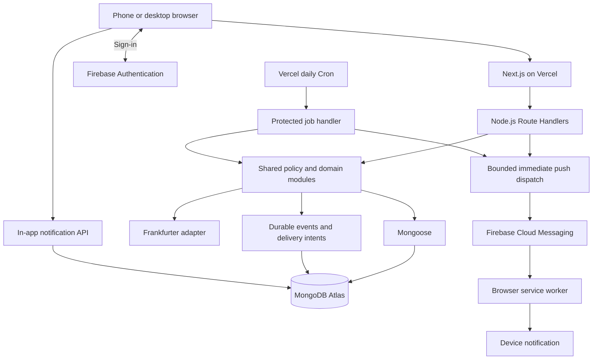

# Buckit — System Design

Version: 0.2 · Status: Updated architecture for review · Date: 23 September 2026

Baseline: PRD.md v1.0 plus the subsequent user-approved decisions in Section 1. This replaces system-design v0.1. It does not deploy infrastructure, authorize spending, or create database/API design documents.

## 1. Approved direction

Build one full-stack Next.js application in TypeScript. Its backend runs on Node.js on Vercel, using Mongoose to access MongoDB Atlas. Firebase Authentication handles identities and verification/password-reset emails. Firebase Cloud Messaging (FCM) supplies optional web push. Frankfurter provides reference exchange rates.

The initial release is non-commercial, shared with friends and family, targeting ₹0 within free-service allowances. Use the Vercel-provided HTTPS URL; no purchased domain is required.

| Area | Approved change since the earlier documents |
| --- | --- |
| Application stack | Next.js/Node.js/Vercel replaces React/Vite/Cloudflare Workers |
| Data | MongoDB with Mongoose replaces D1/SQL |
| Scheduling | Daily processing replaces minute-level/midnight execution and exact reminder times |
| Communication | In-app plus optional web push replaces application email and email digests |
| Invitations | Links, manual WhatsApp sharing and QR; automatic email invitations deferred |
| Authentication emails | Firebase verification and password reset remain |
| Telegram | Excluded; no bot or integration |

PRD.md remains unchanged in this task. Its email/invitation and precise-timing wording needs a separately authorized alignment edit. The decisions above govern this design and are approved changes, not silent feature reductions. Production application email is no longer a V1 prerequisite; no Resend, Gmail SMTP or domain purchase is needed.

## 2. Architecture

Frontend and backend share one Next.js project/deployment; a separate Express server is unnecessary. Node.js executes in bounded Vercel functions, not an always-running server. Never use in-memory timers or node-cron for production scheduling. [Next.js hosting](https://vercel.com/docs/frameworks/full-stack/nextjs) · [Node.js functions](https://vercel.com/docs/functions/runtimes/node-js)

Use the App Router for navigation and Route Handlers for APIs/jobs. Share business logic through TypeScript modules. Pre-render the public landing page; use interactive React components for forms/charts/tour/themes. Keep authenticated responses private and out of shared caches. All Mongoose access is server-side using the Node.js runtime, not Next.js Edge Runtime. [Mongoose compatibility](https://mongoosejs.com/docs/nextjs.html)

The service worker supports push only: it does not introduce offline expense saving or private-data caching. Pin compatible stable dependencies during implementation; no paid UI library is required.

## 3. Free-service limits

Documentation checked on 23 September 2026; verify again during setup. Nothing has been deployed or load-tested.

| Service | Relevant constraint | Design response |
| --- | --- | --- |
| Vercel Hobby | Personal/non-commercial use; finite compute/transfer | Matches stated release; monitor account usage |
| Vercel Cron | Each job once daily at most, invocation within scheduled hour | One daily coordinator; approximate processing window |
| Vercel Functions | Bounded execution, 4.5 MB request/response payload | Checkpoints, small import chunks and pages |
| Atlas Free | About 512 MB including indexes; 500 connections; 100 operations/second | Small pools, indexes, bounded concurrency |
| Atlas operations | No managed backups; idle pause possible after 30 days with zero connections | Independent backup/recovery process |
| Firebase Auth | Spark lists 1,000 verification emails/day and 150 resets/day | Resend throttling; no app-email load |
| FCM | No messaging fee; quotas/device limitations still apply | Controlled fan-out, backoff and token cleanup |
| Frankfurter | Free API with abuse rate limiting | Shared rate cache and manual fallback |

Sources: [Vercel Hobby](https://vercel.com/docs/plans/hobby), [Cron](https://vercel.com/docs/cron-jobs/usage-and-pricing), [Functions](https://vercel.com/docs/functions/limitations), [Atlas](https://www.mongodb.com/docs/atlas/reference/free-shared-limitations/), [Firebase Auth](https://firebase.google.com/docs/auth/limits), [FCM](https://firebase.google.com/products/cloud-messaging), [Frankfurter](https://frankfurter.dev/).

Check the actual Firebase project configuration, including any Identity Platform-specific limits. Do not imply unlimited free usage. Alert at 70%/85% of measured allowances; never automatically enable billing/overages. Show queued/failed operations honestly when quotas are exhausted.

Initial load-test inputs: 25 active users, 50 API calls/user/day, five expenses/user/day, plus shared-bucket comment fan-out. These are testing assumptions, not product caps. Measure stored bytes including indexes/history/notifications and daily job drain time before extrapolating capacity.

## 4. Modules and permission boundary

Modules cover identity/profile, buckets/membership, reference data, expenses/refunds, scheduling/EMI, currency, reports/budgets, comments, notifications, global contacts, CSV and lifecycle operations. Reuse policy/value helpers across API and jobs.

The browser supplies a Firebase ID token over HTTPS. Node.js verifies it with Firebase Admin, checks the active Buckit account, then authorizes the action. Local account tombstones immediately deny access while external identity cleanup retries. [Token verification](https://firebase.google.com/docs/auth/admin/verify-id-tokens)

- Check current membership, lifecycle, resource bucket and actual ownership on every protected read/write/job.
- Paid By and displayed Added By never grant edit rights; imported records belong to the importer.
- Bucket owners administer shared settings/budgets/reference options, not others' expenses/comments/member budgets/EMI plans.
- Only comment authors edit/delete their comments. Every current member may comment.
- Former-member import attribution never restores access or creates users.
- Use recent authentication for ownership transfer/permanent deletion; provider linking requires authenticated identity verification.
- New contact shares require a current common bucket. Existing explicit grants persist after leaving; each read checks its grant.

Keep credentials server-only. Never expose Atlas URIs or accept arbitrary client MongoDB operators. Apply restrictive security headers, text rendering and input allowlists. Scope caches by user/bucket and clear on logout/access loss. Adding cookies later requires explicit CSRF protection; this design uses bearer tokens.

## 5. Data and transactions

Firebase holds sign-in credentials; MongoDB holds application state. Collections conceptually cover profiles, buckets, membership history, references, expenses, EMI obligations/plans, budgets, comments, contacts/grants, rate snapshots, imports, audit events, notifications/device tokens and jobs. Exact schemas/indexes belong in DB_DESIGN.md.

Use separate documents for expenses/comments/installments/notifications rather than unbounded bucket arrays. Preserve distinct actualCreator, paidBy and addedBy references. Contact grants are global and outside bucket deletion cascades.

Cache the Mongoose connection promise per warm function instance. Use small connection pools, no eager minimum pool, bounded connection timeouts and nearby Vercel/Atlas regions. Do not assume instances share a connection. Atlas network access must accommodate Vercel dynamic egress; no free private networking/static IP is assumed. Document any necessary broad IP acceptance and protect it with TLS, strong least-privilege database credentials and monitoring.

Use Mongoose transactions for expense + audit + budget usage + event-intent changes. Pass sessions throughout and execute transaction operations sequentially. External rate/push calls stay outside retryable transactions. [Mongoose transactions](https://mongoosejs.com/docs/transactions.html)

Membership reads alone do not prevent lifecycle races under snapshot isolation. Business writes and leave/archive/delete mutations must conditionally write shared lifecycle guards or equivalent version records, forcing stale operations to conflict/recheck. Resource versions prevent lost edits. Unique keys protect operation IDs, installment sequences, import rows, threshold crossings and delivery intents. Validate references explicitly; MongoDB does not provide application foreign-key authorization.

### Money

Use Decimal128 storage, decimal-string APIs and decimal arithmetic in Node.js. Never calculate money through JavaScript Number. Quantize by currency minor-unit precision, with separate precision for rates and explicit bounds.

Zero original amounts are invalid; negative credits/refunds reduce net spending and budgets. A nonzero foreign amount may round to zero in the bucket currency. Manual converted credits retain their sign and derive a positive rate. Store original/converted amounts, currency, applied rate/date, expense date and manual/provider provenance. Linked refunds copy category/payer defaults and count on their own dates without granting edit rights over the original expense.

## 6. Daily processing and state

A protected daily Cron route selects work whose due time has passed. Vercel Hobby execution occurs within the configured hour; display an approximate local processing window. Do not create offset jobs to imitate higher-frequency scheduling. [Cron timing](https://vercel.com/docs/cron-jobs/usage-and-pricing)

Expenses become eligible at the start of their date in bucket timezone and post during the next daily run, retaining their original date for reports. Until then show Pending daily processing. Normal delay can approach a day plus scheduling variance; outages can extend it. Manual current/past expenses and activity events remain request-driven.

The daily coordinator handles due expenses/EMIs, reminders, push retries and cleanup. Recurrence remains daily/weekly/twice-weekly/every-two-weeks/monthly, but exact user-selected delivery times are not promised. Email digests are removed; no push-digest feature is implicitly added.

Authenticate with CRON_SECRET. Claim leases and process bounded batches with checkpoints/deadline margins. Unfinished work resumes next daily run or via an authenticated operator retry. Vercel does not automatically retry failed cron invocations. Never rely on unawaited work after returning a response. [Cron management](https://vercel.com/docs/cron-jobs/manage-cron-jobs)

Prioritize financial transitions, reminders/delivery, then cleanup with starvation monitoring. Alert on missed runs and work older than one processing cycle. If the small-release workload cannot drain in the function budget, expose that capacity problem.

### Calendar/lifecycle

Store calendar dates independently of UTC timestamps; use IANA timezones. Retain monthly day anchors, use month-end when absent, and return to the anchor afterward. Twice-weekly uses two weekdays; every-two-weeks has a user-timezone anchor. Resolve DST gaps to the next valid instant and repeats to the first occurrence, deduplicating occurrence keys.

Jobs recheck active bucket, creator membership, plan/version, skip/deletion and conversion state before commit. Record archive intervals. On restoration, entries due while archived become creator-resolved pending decisions even if no job ran. Only actual creators post/cancel their overdue entries; future daily processing resumes. Ordinary service downtime catches up automatically rather than requiring archive approval.

| Condition | Reporting effect | Resolution |
| --- | --- | --- |
| Future scheduled | Commitment only | Daily run after eligibility |
| Due, pending daily run | Pending indicator, not yet actual | Processor |
| Posted and converted | Actual signed amount once | Normal creator corrections |
| Conversion needed | Incomplete totals flagged | Creator enters converted amount |
| Pending archive decision | No spending | Creator posts/cancels |
| Skipped EMI | Unpaid obligation, no spending | Plan creator |
| Canceled future entry | No posting | Terminal cancellation |
| Soft-deleted | Excluded, recoverable for 30 days | Creator with current access |

Model scheduling, conversion, deletion and obligations separately so combinations remain explicit.

## 7. EMI, currency and reports

Installment identities derive from plan ID/sequence; previously paid counts create no historical expenses. Long schedules materialize in resumable batches with setup progress. Keep obligations separate from expense records so deleting a payment leaves it unpaid without automatic recreation. Plan changes affect future entries by default. Ending cancels future commitments and preserves history; single-installment rescheduling/skipping leaves other dates unchanged. Version guards stop old jobs recreating canceled installments.

Fetch only currency pairs/dates from Frankfurter. Use published rates on/before the original expense date, cache and freeze snapshots. Future estimates become finalized at daily posting unless manually fixed. No usable rate means Conversion needed; only the creator supplies the primary-currency amount and the app derives/stores the rate. Return unresolved counts with reports, never zero or estimates disguised as finalized totals. [Rate documentation](https://frankfurter.dev/)

Use one reporting predicate: posted, converted, nondeleted entries in the requested date interval. Sum signed primary-currency amounts; separate scheduled/pending/unresolved indicators. Indexed aggregation starts with bucket/date/state filters and avoids full-history application-memory scans. Dashboard panels share a consistent snapshot/version strategy. Compare equal elapsed calendar portions, clamped to valid comparison dates.

Shared budgets match all payers; member budgets match Paid By. Overlapping budgets do not duplicate overall spending. Update affected usage periods transactionally when date/category/payer/amount/state changes. Available thresholds: 50%, 75%, 85%, 90%, 95%, 100% and custom, none preselected. Mark each once per period; multiple crossings in one change emit only the highest alert and mark all crossed selections handled. Refunds do not reset markers. Imports update usage/threshold markers without notifications or delayed alert replay.

## 8. In-app and push communication

Independent In-app/Push controls apply per trigger. In-app initially enabled; Push off until explicit user action and device permission. Either, both or neither can be enabled. No application-email, Telegram, SMS or automated WhatsApp channel. Firebase verification/reset emails remain separate. Imports/exports have on-screen outcomes and history, but no notification fan-out.

| Event | Recipients |
| --- | --- |
| Expense added/edited/deleted | Current bucket members with enabled channels |
| Comment added | Other members, excluding commenter |
| Membership changes | Relevant authorized users; no private content after access loss |
| Shared budget threshold | Current members |
| Member budget threshold | Budget creator |
| Scheduled/EMI activity | Authorized members; creator for conversion action |
| Contact share/change/revoke | Relevant creator/recipients only |
| Personal reminder | Configured user |

Group labels organize settings; supported individual triggers remain independently configurable. Recheck access/preferences before dispatch. Disabling a channel suppresses unsent work; enabling it does not replay suppressed history.

### Inbox

Create inbox items only for recipients with In-app enabled, with unread count/history/read state and authorized links. Refresh after actions/on focus and use adaptive foreground polling; stop hidden-tab polling. Push-only users do not receive unintended inbox copies.

### Device setup

FCM Web requires HTTPS, supported browser, service worker and permission. Store per-installation tokens bound to the signed-in user with timestamps; configure Web Push/VAPID credentials. Detect support and prompt only after a deliberate user gesture. [FCM Web setup](https://firebase.google.com/docs/cloud-messaging/web/get-started)

On iPhone/iPad, supported push requires adding Buckit to the Home Screen. Supply a manifest and brief instructions. This does not require a native app, app-store submission or offline saving. [Apple requirements](https://webkit.org/blog/13878/web-push-for-web-apps-on-ios-and-ipados/)

Use generic lock-screen text by default: “You have a new update in Buckit.” Exclude financial details, titles, names, contact information and comment text. Clicking opens an authenticated route that fetches current authorized data. Lost access shows unavailable rather than cached details.

Each enabled device can receive push; an inbox event remains one per user. Rebind/disable tokens safely on logout/account switching, refresh registrations, clear app-controlled notifications where feasible and remove invalid tokens. Recheck registration ownership at send time. [Token management](https://firebase.google.com/docs/cloud-messaging/manage-tokens)

Push is best effort: OS/browser settings, connectivity and expired registrations affect delivery. Acceptance is not proof of display. If denied/unsupported, Buckit remains usable with the user's enabled inbox; never substitute email or enable a disabled channel.

### Dispatch

Persist events/intents with business mutations. Fan out in bounded batches. Requests may await a short immediate push attempt; remaining work is durable for daily retry. Deduplicate event/recipient/channel/device identities and use stable notification tags. FCM does not guarantee exactly-once display: ambiguous timeouts can still duplicate delivery. Expire stale reminders instead of replaying an unlimited backlog, remove invalid tokens and back off transient errors.

Handle foreground/background messages without double display. Do not expose private events through guessable bucket topics; target authorized device registrations server-side. [Message handling](https://firebase.google.com/docs/cloud-messaging/web/receive-messages)

## 9. Invitations and contacts

Owners create seven-day multi-use shareable links/QR codes, revocable at any time. WhatsApp sharing is manual. Hash high-entropy tokens, omit them from logs/referrers, validate bucket state and require authenticated acceptance; previews/scans do not join automatically. No misleading Send email control. Push cannot reach new users who have never enabled it; invite links remain essential.

Contacts stay global. The share search returns associated users and only mutually shared bucket names. Explicit grants survive leaving/deleting a bucket until revoked. Creators alone edit/delete/share further; recipients view/use or hide their own shared view. Bucket deletion does not cascade into contacts.

## 10. CSV

Columns: `Date, Description, PaidBy, Category, Platform, Payment Mode, Bank Account, Amount, Currency, Added By, Notes, Comments, Status`.

Parse in a browser worker but validate every row server-side. Date uses DD/MM/YYYY. Missing Currency defaults to bucket currency; Platform to Other; Added By to importer; Notes is optional. Resolve required values. Comments are export-only and Status is derived, not trusted input. Preview all defaults, mappings, duplicates, negatives, scheduling, conversions and ownership. Owner-only alternate attribution/reference creation remains enforced.

Initial technical envelope: 5 MiB local file, 5,000 rows and bounded cell lengths. Upload normalized preview chunks capped at 512 KiB, never the whole file as one Vercel request. Commit smaller validated batches; tune with tests and reject excess explicitly without truncation. Expiring previews have revisions; recheck permissions at confirmation and each batch.

Unique session/row keys prevent retry duplicates. Chunk transactions update expenses, usage and history atomically. Show durable partial outcomes/progress; resume uncommitted rows only. Archive/access loss stops remaining work. User-driven continuation may complete while the app is open; background continuation follows the daily schedule.

Export current filters or all entries, excluding deleted rows and including scheduled entries only when selected, with Status. Use a stable export snapshot/version policy and bounded pages with repeated membership checks. Build the CSV browser-side to avoid response limits. Quote multiline comments with author/time and escape spreadsheet-executable text while preserving negative numeric amounts. CSV is not a full backup of plans, history, comment structure or conversion provenance. No import/export notifications.

## 11. Lifecycle and recovery

Departure immediately ends access and updates lifecycle guards. Suppress future records before resumable cleanup removes actual-creator future expenses/installments and stops generation. Freeze their member budgets as read-only history. Preserve historical records. Payer/Added By departure alone does not remove another creator's records; rejoining never resurrects canceled schedules.

Soft deletion retains state/deadline for 30 days. Enforce expiry even before physical daily purge. Restoration requires current access, actual ownership and active bucket, re-evaluating date/archive/conversion rules. Deleted EMI payments stay unpaid without scheduler recreation.

Permanent bucket deletion requires owner, recent authentication and typed-name confirmation. Record irreversible intent, deny access, revoke invites/block jobs, then purge content in resumable chunks. Preserve only minimal non-content tombstones against resurrection. Global contacts/grants remain.

User deletion requires shared-bucket ownership transfer and explicit sole-bucket handling. Block the local account, apply departure cleanup, remove owned contacts/shares/push registrations, delete Firebase identity with retryable administration and anonymize retained history as Deleted user, including copied profile data in event/audit payloads.

### Backups

Atlas Free has no managed backups. Use encrypted mongodump exports and tested mongorestore from operator-controlled secure storage. Free-tier dumps lack oplog capture: use a controlled write pause or separately validated snapshot method. The 30-day in-app recovery window is not a backup.

Configure/test daily and pre-migration backups before real use; an available backup machine/storage location is a prerequisite, not an assumed free always-on service. Monitor last successful backup age. A 24-hour recovery-point and one-working-day recovery-time target is unverified until a restore drill passes.

Keep deletion tombstones outside restored snapshots. Reapply permanent deletion/anonymization before reopening access and suppress old notification delivery. Buckit offers no restore for permanently deleted buckets; encrypted historical backup copies can persist until retention expiry. Do not promise instant physical erasure from every copy.

## 12. Deployment, operations and validation

- One Next.js Vercel project; database hosted separately on Atlas.
- Local development uses transaction-capable MongoDB, Firebase emulators where applicable and mocked push. Preview deployments must not use production data/tokens/cron secrets.
- Pin runtime/dependency versions, nearby regions and bounded function duration/pools.
- Use versioned schemas and explicit migrations; Mongoose validation does not replace indexes/transactions. Avoid index creation on every cold start.
- Prefer additive compatible changes, backup before destructive migrations and test rollback/recovery.
- Log IDs/error categories/latency/usage, not private payloads, tokens or credentials.
- Monitor missed daily runs, backlog, pending conversion, imports, deletion, Atlas storage/connections and push errors.
- Rate-limit invites, comments, contact search, auth-email resends, imports/exports and device registration.

Release tests must cover ownership versus attribution, cross-bucket/contact isolation, lifecycle races, transaction retries, daily missed-run recovery, month-end/DST, EMI cancellation/deletion, signed decimal refunds, manual conversion, overlapping budgets and once-only alerts, legacy CSV/chunk retries, channel independence/commenter exclusion/import suppression, multiple devices/logout/denied push, iOS Home Screen support, generic lock-screen content, invite expiration/revocation and backup deletion replay.

Engineering target: ordinary warm API responses under one second at the 95th percentile for the small-release test load; cold starts/provider failures measured separately. No benchmark or delivery SLA is claimed. Scheduled work deliberately follows the daily window; action-triggered push is attempted immediately where feasible.

## 13. Review and next document

Communication is resolved: in-app plus optional web push, no Telegram/application emails, Firebase authentication emails retained. Stack and daily scheduling reflect the latest agreement. No infrastructure or real notifications were created/sent by this update.

Ready for review; provider setup, device testing and load validation remain implementation work. PRD v1.0 is unchanged and should be aligned with Section 1 through a separately authorized edit.

After this design is accepted and the PRD aligned, recommend DB_DESIGN.md next, then API_DESIGN.md, one at a time when requested. Neither has been created.
